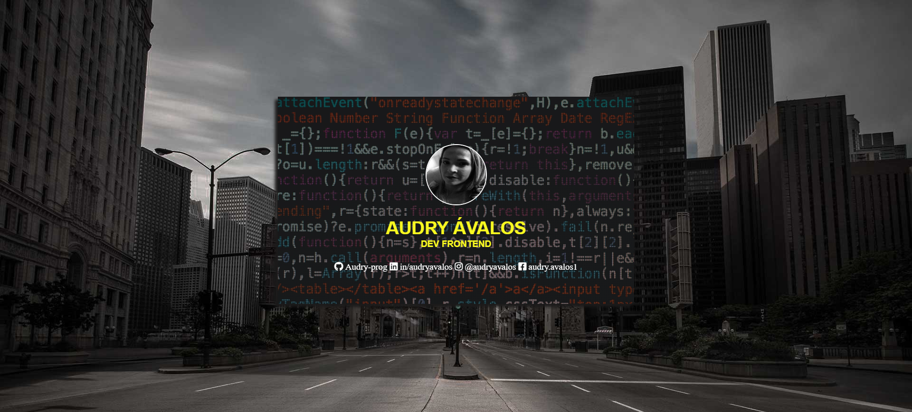

# Projeto Final Front-end da WoMakersCode

Olá, o projeto é o resultado prático de tudo o que aprendi durante o meu curso com a WoMakersCode, onde encerro minha linha de aprendizagem com a construção do meu cartão de visita online.

Contém informações de contato e uma mini-bio no verso do cartão para que os recrutadores e entrevistadores possam ter acesso ao meu trabalho.

**Cartão de Visita:** <https://audry-prog.github.io/projeto-final-frontend-womakerscode/>

## Print da tela do projeto

